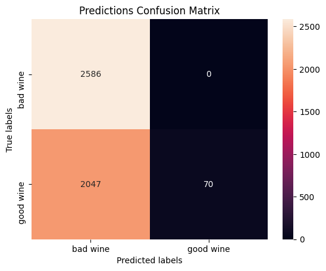
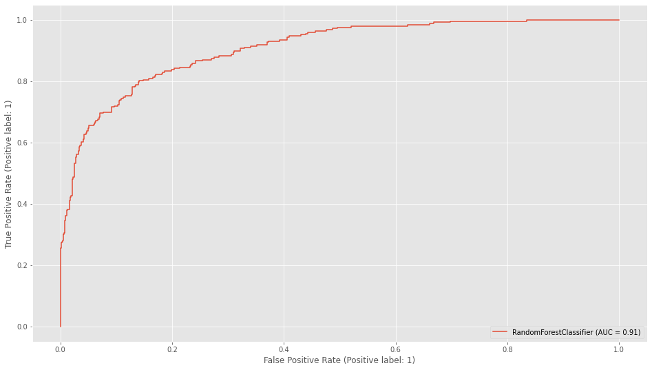
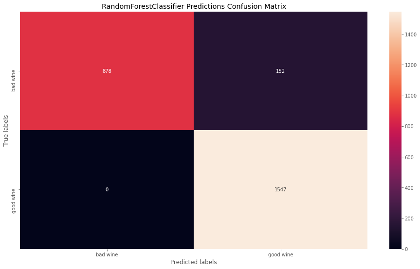

# Deep Learning - Wine Quality

## The Mission

Wine tasting has been around since the creation of wine itself. However, in the modern era, more importance has been given to drinking a good wine, e.g. a French Bordeaux. France has always been hailed as the land of the wine. However, during the Judgment of Paris in 1976, a Californian wine scored better than a French wine which led to the increase in popularity of Californian wine.

Moreover, it has been shown that there are many biases in wine tasting.

That is why we put together this project to let an AI predict the quality of a wine.

## Installation

### Python version
* python 3.9

### Packages
* Numpy
* Pandas
* Keras - Tensorflow
* Sklearn
* Matplotlib
* Seaborn

## Usage
* nn_wine_quality.py -> DL Neural Network (Keras) model
* ml_wine_quality.ipynb -> ML (Sklearn) model

## Base Line NN Model (Binary Classification)

### Data
* [wine.csv](https://github.com/becodeorg/GNT-Arai-2.31/blob/master/content/additional_resources/datasets/Wine%20Quality/wine.csv)
* Nº features = 11
* Nº samples = 5318
* Target classes: 
    * good [quality > 6] -> 1
    * bad [quality < 7]  -> 0
* test_size = 30%

### Model Architecture
* model type = **Sequential**
* Nº hidden layers = 3
* Nº units = 64
* activation = 'relu'
* output layer activation = 'sigmoid'
* optimizer = 'rmsprop'
* loss = 'binary_crossentropy'
* metrics = 'accuracy'
* epochs = 75

### Model Evaluation
#### Training:
* loss: 0.4684 - accuracy: 0.8117

#### Test:
* loss: 0.3987 - accuracy: 0.8133

## Model Tuning

#### 1. Target Vectorization
* Classes = 1 (good wine) / 0 (bad wine)

#### 2. Resampling (data balance)
* Nº samples = 15398
    * 0 - 4310
    * 1 - 11088

#### 3. Data Shuffle & Split
* pd.sample()
* test_size = 0.3
* stratify target

#### 4. Standardization
* StandardScaler()

#### 5. Hyper-parameter tuning & Architecture:
* Nº Hidden layers = 4
* Nº units = 1024/512/64/1
* acivation = 'tanh'
* optimizer = 'adam'
* loss = 'mse'
* kernel_initializer = 'normal'
* epochs = 100
* callbacks.EarlyStopping(patience=10)

## Model Evaluation
#### Training:
* loss: 0.0023 - accuracy: 0.9998

#### Test:
* loss: 0.0395 - accuracy: 0.9584

#### Visuals:

### ML RandomForestClassifier

* 0.93 cv score with a standard deviation of 0.01
* roc_auc_score: 0.926

### Final Word
* After initial analysis, the basic NN model showed perfect predictions on class 0 (bad wine) and complete wrong predictions on class 1 (good wine). 

* The number of data samples wasn't enough for either model, so **over-sampling** was necessary in order to achieve better performance.

* **Neural Network** achieved high train and test scores; predicting class 0 ('bad wine') accurately yet the predictions of the class 1 ('good wine') wasn't as accurate as expected, even though classes were purposefully unbalanced (more 1s than 0s).

* **Machine Learning** (RandomForestClassifier) model showed high scores as well as more accurate predictions for both classes.

* Note: This challenge was a useful exercise to gain better knowledge of deep learning and the use of neural networks.