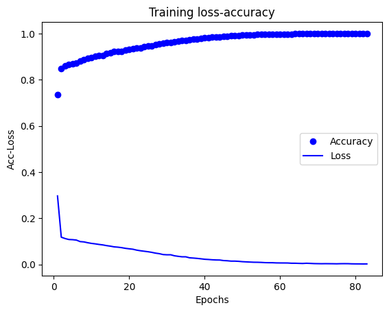

# Deep Learning - Wine Quality

## The Mission

Wine tasting has been around since the creation of wine itself. However, in the modern era, more importance has been given to drinking a good wine, e.g. a French Bordeaux. France has always been hailed as the land of the wine. However, during the Judgment of Paris in 1976, a Californian wine scored better than a French wine which led to the increase in popularity of Californian wine.

Moreover, it has been shown that there are many biases in wine tasting.

That is why we put together this project to let an AI predict the quality of a wine.

## Installation

### Python version
* python 3.9
### Packages
* Pandas
* Matplotlib
* Keras - Tensorflow
* PyTorch

## Usage
* nn_wine_keras.ipynb
* nn_wine_pytorch.ipynb

## Base Line Model (Binary Classification)

### Data
* wine.csv
* Nº features = 11
* Target = Good wine (1) or Bad wine (0)
* Nº samples = 5318 (test_size = 30%)

### Model Architecture
* model type = **Sequential**
* Nº hidden layers = 3
* Nº units = 64
* activation = 'relu'
* output layer activation = 'sigmoid'
* optimizer = 'rmsprop'
* loss = 'binary_crossentropy'
* metrics = 'accuracy'
* epochs = 75

### Model Evaluation
#### Training:
* loss: 0.4684 - accuracy: 0.8117

#### Test:
* loss: 0.3987 - accuracy: 0.8133

## Model Tuning

#### 1. Resampling
* Nº samples = 8342

#### 2. Normalization

#### 3. Hyper-parameter tuning:
* Nº Hidden layers = 4
* Nº units = 32
* acivation = 'tanh'
* optimizer = rmsprop
* lr = 0.01
* epochs = 500

### Model Evaluation
#### Training:
* loss: 0.0047 - accuracy: 0.9996

#### Test:
* loss: 0.0991 - accuracy: 0.8949

#### Visualization

